# 1. HX-65HM Bus Servo User Manual

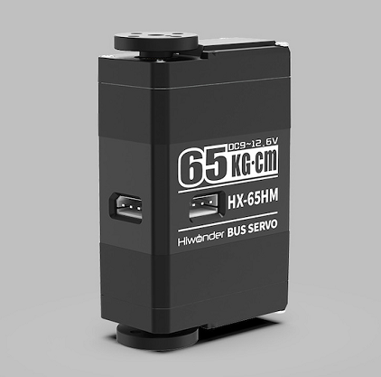

## 1.1 Product Instruction

### 1.1.1 Introduction

The HX-65HM magnetic encoder bus servo integrates the servo driver, motor, and bus servo signal into a single unit. It is controlled through serial commands and operates at a baud rate of 115200. Based on the communication protocol provided, the servo can be commanded to control motion or to read status data. Three modes of operation are defined: Position mode, Velocity (Closed-Loop) mode, and PWM (Open-Loop) mode.

A half-duplex UART asynchronous serial interface is implemented in the servo. Each unit includes three connectors to support serial daisy-chained together. In theory, up to 253 bus servos can be connected in series. This servo is applied extensively in robotic projects that demand closed-loop control, including joint mechanisms in biomimetic robotic.

### 1.1.2 Working Principle

The internal structure of a servo generally includes a housing, a gear reduction system, a motor, a potentiometer, and the associated control electronics.

Communication is established via an asynchronous serial bus, where the signal wires are connected in series while the positive and negative power lines are wired in parallel. The servo is controlled by sending the required command instructions from the controller. In serial communication, each transmission must be packaged and interpreted according to a defined frame format.

This structure generally includes a frame header, device ID, data length, instruction, parameters, and a checksum. And the frame header functions as the start marker that indicates the initiation of a new transmission.

The ID uniquely identifies each device. The data length indicates the size of the data payload, and the total command packet length is obtained by adding three bytes to this value, spanning from the frame header to the checksum. The instruction represents the control operation of the servo, while the checksum provides error detection to ensure reliable data transmission.

During serial communication, the bus servo first transmits a request to the controller along with the relevant parameters such as position. The command packet includes the target servo ID, ensuring that only the addressed servo responds. Execution results and related status data are packaged into a feedback frame and sent back to the controller, where the information is decoded and processed accordingly.

This capability allows bus servos to support synchronized multi-servo control and efficient data communication, greatly improving overall system scalability and flexibility and making them a key component in robotic systems.

Regarding the bus servo communication protocol, please refer to [**Hiwonder Magnetic Encoder Bus Servo Communication Protocol Document\ 3 Servo Manual & Diagram**](https://drive.google.com/drive/folders/1rog58Tn6kE3b30TCjtD8Hkaf6mwxKgja).

### 1.1.3 Servo Horn Installation & Pin Instruction

1. Refer to the image below for servo horn installation. For the HX-65HM, installation should be performed with the servo set to its central position and aligned with the red cross shown in the figure below. If the servo horn cannot be installed in a cross alignment at central, refer to [**1.4.3.2 Reading and Configuring Servo Information**](#anther1.4.3.2) and use the position calibration parameter in the motion control position settings to correct the servo offset.

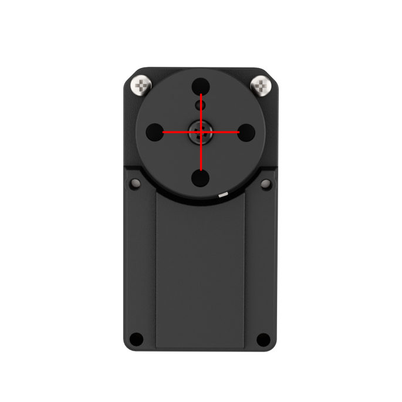

2. The port distribution and instruction refer to the following picture and table:

<table border="1">
  <thead>
    <tr>
      <th> Pin (from left to right)</th>
      <th>Instruction</th>
    </tr>
  </thead>
  <tbody>
    <tr>
      <td>GND</td>
      <td>Power ground</td>
    </tr>
    <tr>
      <td>VIN</td>
      <td>Power input</td>
    </tr>
    <tr>
      <td>SIG</td>
      <td>Signal terminal for half-duplex UART asynchronous serial interface</td>
    </tr>
  </tbody>
</table>

> [!NOTE]
>
> **If the servo and the microcontroller use different power supplies, the grounds of both supplies must be connected to ensure proper operation.**

### 1.1.4 Packing List

The servo and its accessories included in the shipment are shown in the image below:

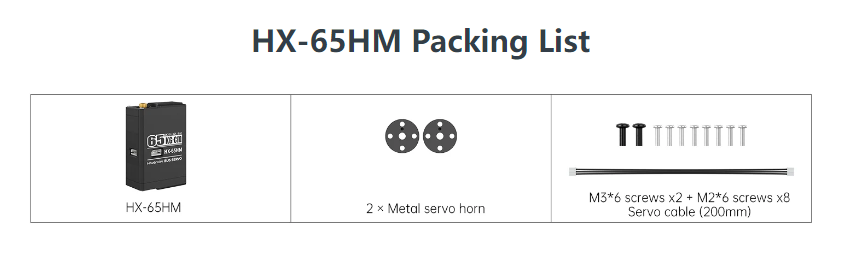

## 1.2 Parameter

<table border="1">
  <thead>
    <tr>
      <th>Product</th>
      <th>HX-65HM Magnetic Encoder Linear Bus Servo</th>
      <th>Control method</th>
      <th>UART serial command</th>
    </tr>
  </thead>
  <tbody>
    <tr>
      <td>Brand</td>
      <td>Hiwonder</td>
      <td> Communication baud rate</td>
      <td>115200</td>
    </tr>
    <tr>
      <td>Weight</td>
      <td>143.5g</td>
      <td> Storage</td>
      <td> Save data when power off</td>
    </tr>
    <tr>
      <td> Size</td>
      <td>45x25x70mm</td>
      <td>Servo ID</td>
      <td>Can be set to 0-253, 1 by default</td>
    </tr>
    <tr>
      <td>Working voltage</td>
      <td>9–12.6 V</td>
      <td>Angle read back function</td>
      <td> Support</td>
    </tr>
    <tr>
      <td>Rotation speed</td>
        <td>0.19sec/60° 11.1V</td>
      <td>Protection</td>
      <td>Stall and overheat prevention</td>
    </tr>
    <tr>
      <td>Servo torque</td>
      <td>
          
50KG·cm 9.6V

          
65KG·cm 12.6V

      </td>
      <td>Data feedback</td>
      <td>Temperature, voltage and position</td>
    </tr>
    <tr>
	  <td>Rotation range</td>
      <td>0° ~ 360°</td>
      <td>Working mode</td>
      <td>Servo Mode and Geared Motor Mode</td>
    </tr>
    <tr>
      <td> No-load current</td>
      <td>80mA</td>
      <td>Gear type</td>
      <td>Metal gear</td>
    </tr>
    <tr>
      <td>Stall current</td>
      <td>5A</td>
      <td>Servo wire length</td>
      <td>20cm，optional wire lengths available</td>
    </tr>
    <tr>
      <td>Servo precision</td>
      <td>0.3°</td>
      <td>Connector</td>
      <td>5264-3P</td>
    </tr>
    <tr>
      <td>Control angle range</td>
      <td>0~4095，corresponding to 0°~ 360°</td>
      <td>Application</td>
      <td> All kinds of bionic robot related joints</td>
    </tr>
  </tbody>	
</table>

## 1.3 Notice

Please carefully read the following precautions before operations:

1. This bus servo operates within a voltage range of 9 to 12.6 V and requires a stable power supply within this range. Overvoltage may cause damage to the servo, while insufficient voltage may prevent proper operation.

2. The bus servo is factory-set with a default ID of 1. Prior to operation, the servo ID should be preset according to application requirements.

3. Due to the daisy-chain capability of bus servos, each servo should be connected individually when configuring the ID. Otherwise, all connected servos will be assigned the same ID. The servos can be interconnected after ID assignment is complete.

4. The bus servo is a high-precision device. Once powered on, the servo arm or servo disc must not be forcibly rotated ;by hand, in order to prevent internal damage.

5. Extended continuous operation can cause the bus servo to heat up. Allowing the servo to cool down after a period of operation helps prevent overheating and protects both performance and service life.

6. During continuous rotation operation, the load must remain below the stall torque of the bus servo. For reliable performance, the recommended load range is 1/5~1/3 of the stall torque.
   
   Stall torque refers to the maximum torque that a servo can deliver when its rotation is fully prevented by an external load. Because energy losses occur during servo operation, the load should be properly controlled and kept within the rated limits. Excessive loading forces the servo to operate under increased stress, resulting in higher energy consumption and reduced efficiency.
   
7. Bus servo communication lines may be affected by electromagnetic interference.  To ensure stable and reliable signal transmission, it is recommended to avoid routing these lines near high-power cables, motor cables, or other potential sources of electromagnetic interference.

8. For bus servos, the angular control range and speed should be appropriately configured based on actual project requirements. This ensures all motion stays within safe limits, prevents exceeding mechanical constraints or excessive velocity, and avoids unintended collisions or damage.

## 1.4 Servo Testing Operations

### 1.4.1 Magnetic Encoder Servo Debugging Board Introduction

The magnetic encoder servo debugging board is a tool designed for servo testing and configuration. With the accompanying ServoStudio PC software, servo performance can be tested and parameters can be configured. The debugging board also supports serial communication with a microcontroller, enabling servo control through the serial interface.

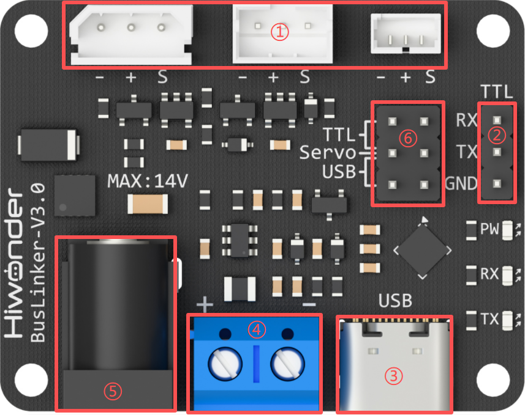

<table border="1">
  <thead>
    <tr>
      <th>Index Instruction</th>
      <th>Function Instruction</th>
    </tr>
  </thead>
  <tbody>
    <tr>
      <td>① 3pin Bus Servo Interface</td>
      <td>Connecting and debugging Bus Servo</td>
    </tr>
    <tr>
      <td>② Serial Port Pins</td>
      <td>It communicates with other MCUs via the serial port</td>
    </tr>
    <tr>
      <td>③ Type-C Interface</td>
      <td>It communicates with PC software/hardware Controller </td>
    </tr>
    <tr>
      <td>④ Power Terminal</td>
      <td>Lithium Battery Power Connection</td>
    </tr>
    <tr>
      <td>⑤ DC Interface</td>
      <td> Adapter Power Connection</td>
    </tr>
    <tr>
      <td>⑥ Communication Mode Select Pins</td>
      <td>Switch Communication Mode: USB/TTL</td>
    </tr>
  </tbody>
</table>

### 1.4.2 Hardware Connection

1. The servo should be connected to the 5264 three-pin bus servo interface on the debugging board using a servo cable.

2. Connect the red wire to the + terminal and the black wire to the - terminal on the debugging board, then attach the USB cable.

> [!NOTE]
>
> * **Ensure that the positive and negative terminals of the battery connection cable are not reversed.**
> * **Connect the jumper cap to the Servo and USB pins on the lower row.**

3. Connect the lithium battery to the adapter cable, which features a reverse-polarity protection design, and the connector should not be forced if it does not mate correctly.

   If a lithium battery is not available, a stable 12 V power supply should be prepared separately.

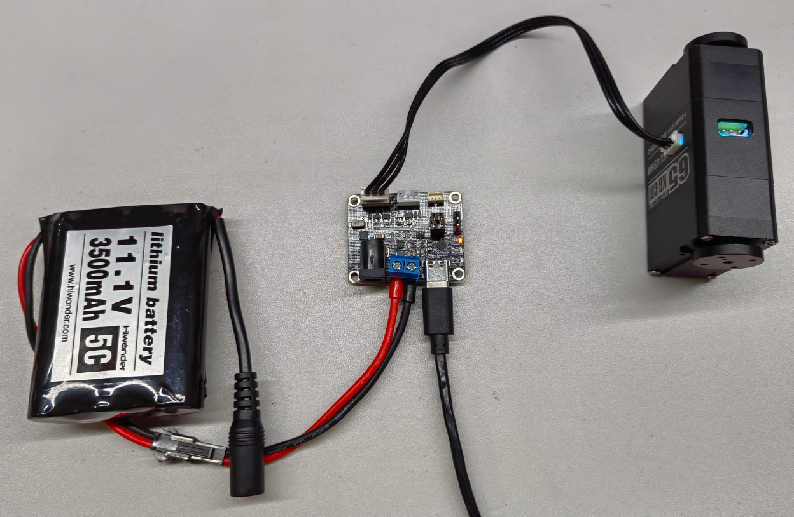

### 1.4.3 PC Software Testing Description

**1.4.3.1 Servo Status Description**

The following three images illustrate the three basic servo positions, including the central position, the maximum angle, and the minimum angle. For visual reference, a servo arm is mounted as an example, with the initial position defined by attaching the label to the right side.

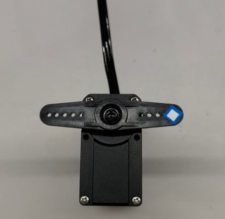

Central position (adjustable):  Servo angle 180°, corresponding position value 2047.

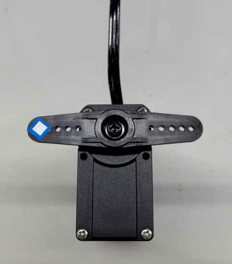

Maximum position per revolution: Servo angle 360°, corresponding position value 4095.

Minimum position per revolution: Servo angle 0°, corresponding position value 0.

**1.4.3.2 Reading and Configuring Servo Information**

1. Open the servo debugging board software located at  [**2 Softwares \Servo Debugging Board Software**](https://drive.google.com/drive/folders/1JCv0S8oLnJ7ZwmIVh5_yak_hAIhHTQDH). On the left side of the interface, select the appropriate serial port, keep the default baud rate of 1000000, and then click **Connect**.

2. Once the serial connection has been completed, click **Scan** in the Dashboard. The PC software then scans servo IDs 1–253 and displays the specific servos on the screen.

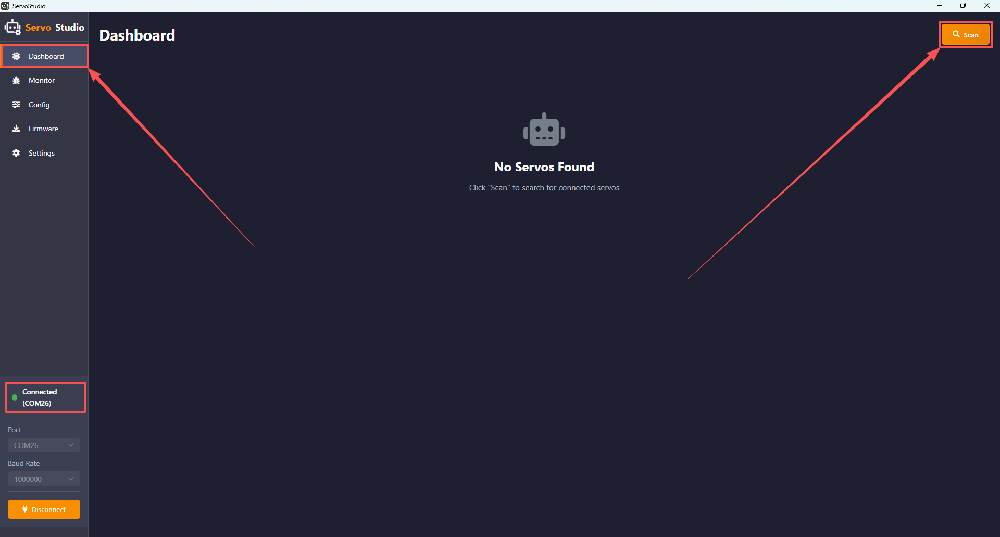

3. Click **Config** to access the parameter settings interface. This displays the servo's current parameter information and allows for adjustment.

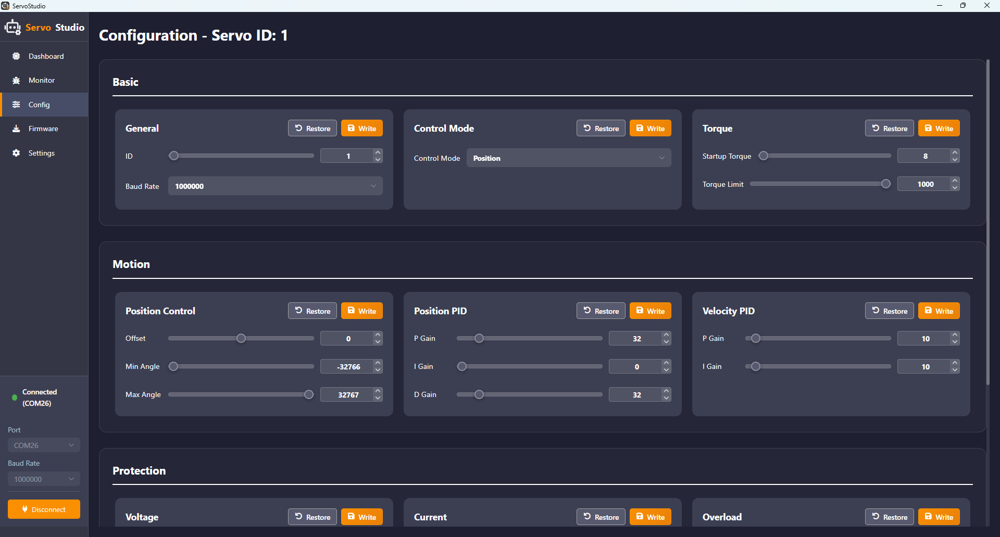

(1) General Configuration

①  General Setting

Within this panel, the servo ID and the communication baud rate between the PC software and the servo can be modified. The available ID range is from 1 to 253, with eight distinct baud rate options available for selection.

②  Operating Mode

This panel allows selection of three modes: Position, Velocity (Closed-Loop), and PWM (Open-Loop).

In position mode, the servo operates in servo mode. In both Velocity (Closed-Loop) and PWM (Open-Loop) modes, the servo operates in Motor Mode.

③  Torque Control

This function is used to set the servo's minimum startup torque and the maximum output torque limit. A value of 1000 corresponds to 100% of the stall torque.

> [!NOTE]
>
> **An insufficient torque setting may prevent the servo from operating correctly.**

(2) Motion Control

①  Position Control Parameters

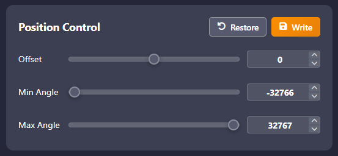

* Position Calibration is used to correct servo offset, with a configurable threshold range of -2047 to 2047. If the servo horn cannot be installed in a proper cross-orientation due to positional deviation, this parameter can be adjusted to compensate for the misalignment.
* The Minimum/Maximum Angle Limit function restricts the servo's rotation range within a threshold of -30719 to 30719. In Absolute Position Mode, the maximum positional range is -30719 to 30719, where a position value of 0 to 4095 corresponds to a 0° to 360° rotation. Therefore, the maximum rotational range equates to approximately ±7.5 revolutions. The operational threshold for the servo's rotation can be set within this range according to specific application needs.

②  Position Closed-Loop Parameters

Three parameters are used to tune the servo position error. The **P** parameter determines how the current position error influences the control output. The **I** parameter reduces long-term steady-state error and is typically not adjusted. The **D** parameter limits the rate of error variation, thereby improving system stability. These parameters may be adjusted as required to achieve the desired performance.

③  Speed Closed-Loop Parameters

Two parameters are used to regulate the servo speed error, ensuring motion at the specified speed while maintaining accurate speed control. These parameters may be adjusted as required to achieve the desired performance.

(3) Safety Protection

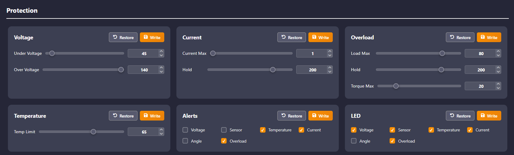

Thresholds for each panel can be configured as required, and the targets for protection and alarm triggering can be selected accordingly.

* The undervoltage and overvoltage thresholds range from 0 to 254, with a unit of 0.1V.
* The overcurrent threshold ranges from 0 to 6000 mA. The overcurrent protection time threshold ranges from 0 to 254, with each unit corresponding to 10 ms.
* The overload threshold ranges from 0 to 100, with each unit representing 1 percent of the maximum torque. The overload time threshold ranges from 0 to 254, with each unit corresponding to 10 ms. And the overload torque defines the maximum output torque after overload protection is triggered and is adjustable from 0 to 100 in 1%.
* The overtemperature protection threshold ranges from 0 to 100 degrees Celsius.

**1.4.3.3 Servo Operation Control**

Click the **Monitor** option on the left to enter the servo debugging interface.

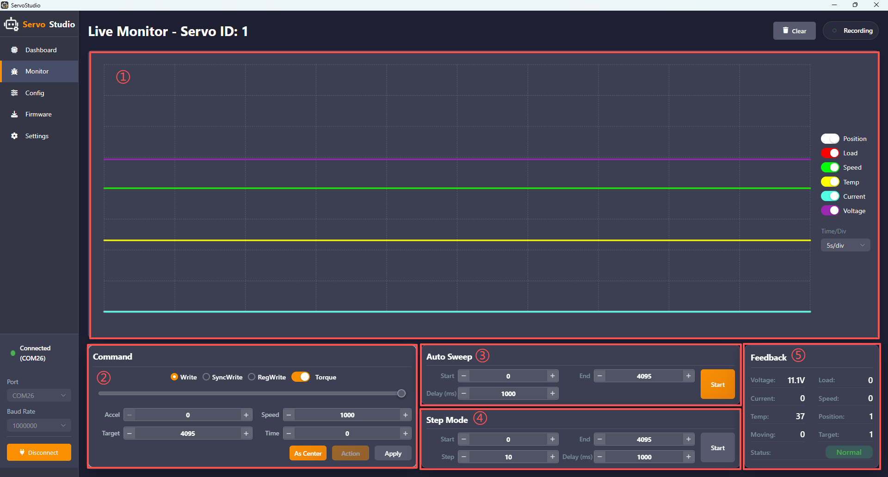

The interface includes five sections: ① Servo operation parameter waveform area. ② Servo operation control area. ③ Auto sweep area. ④ Step mode area. ⑤ Feedback area.

The five areas are described as follows:

① Servo Operation Parameter Waveform Area:

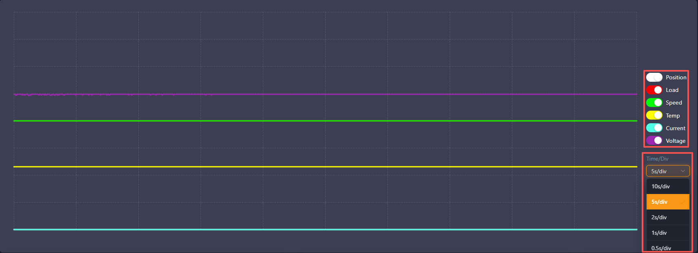

This area provides a clear visualization of the changes in six servo parameters during operation. On the right side, display parameters can be enabled as required. At the bottom, the time scale represented by each grid division can be selected.

② Servo Operation Control Area:

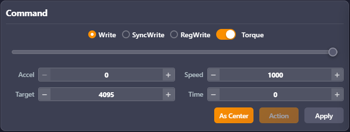

This area allows configuration of the three servo write modes: **Write**, **SyncWrite**, and **RegWrite**. Detailed information about these write modes can be found in the [Hiwonder Magnetic Encoder Bus Servo Communication Protocol Document](https://drive.google.com/drive/folders/1rog58Tn6kE3b30TCjtD8Hkaf6mwxKgja). The **Torque** switch controls whether power is supplied to the servo. When this switch is turned off, the servo is powered down and stops producing torque, allowing the servo arm to be rotated manually if installed. The **Slider** in the center of the interface provides direct servo control with a range of 0 to 4095. The lower section allows configuration of the servo's **Accel**, **Speed**, **Target**, and **Time**.

**Accel** — acceleration, range 0–254, unit 100 steps/s².
**Speed** — speed, range 0–3400, unit steps/s.
**Target** — target position, range -30719 to 30719, unit steps.
**Time** — time, range 0–1000. 

At the bottom, three buttons are provided:
**As Center** sets the current target position as the central position. **Action** triggers motion in asynchronous write mode. **Apply** sends parameters to the servo in normal write and synchronous write modes.

> [!NOTE]
>
> * **The Time parameter is not applicable in Position Mode.**
> * **In Velocity (Closed-Loop) Mode, only the Speed parameter is effective.**
> * **In PWM (Open-Loop) Mode, only the Time parameter is effective.**

③ Auto sweep area:

In this area, the **Start** and **End** rotation positions for the servo can be set, with a threshold range of -30719 to 30719 measured in steps. The **Delay** defines the interval between sending the **Start** and **End** positions. **Speed** is configured in the control area. Upon clicking the **Start Scan** button, the servo will begin moving between the two specified positions.

> [!NOTE]
>
> **If the Delay is shorter than the duration required to move between the two positions, the current motion will be interrupted.**

④  Step mode area:

In this area, the **Start** and **End** rotation positions for the servo can be set, with a threshold range of-4095 to 4095 measured in steps. The **Step** is configurable within a range of 0 to 1000 steps. The **Delay** defines the interval between step commands. After clicking the **Start**, the servo moves from the **Start** position to the **End** position using the specified **Step** and **Delay** as control parameters.

⑤ Feedback area:

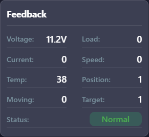

This area provides a clear visualization of the servo operating status and all related parameters during operation.