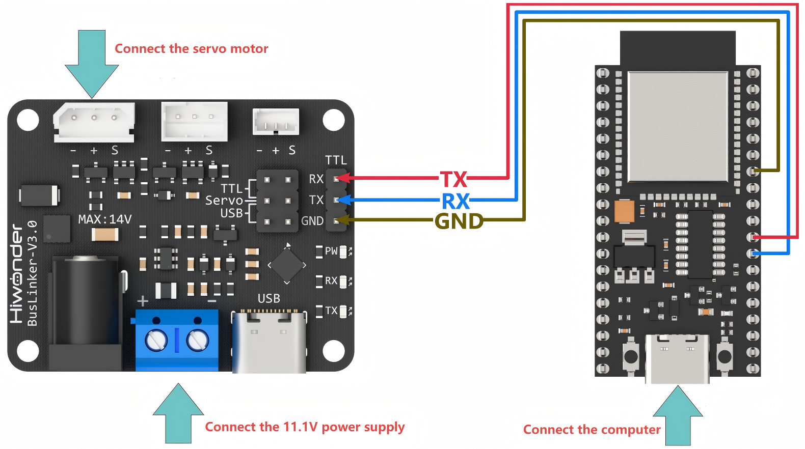
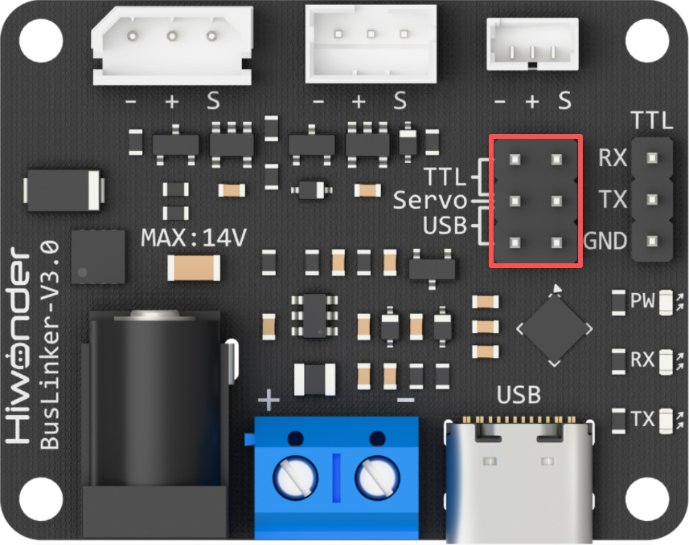
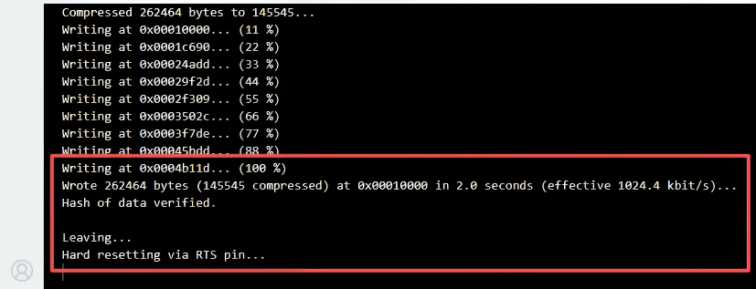
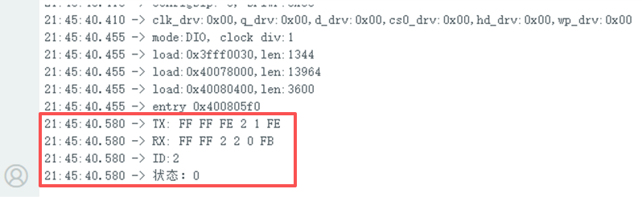
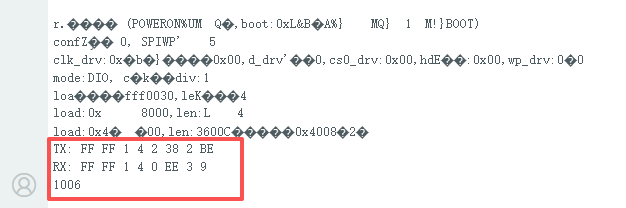
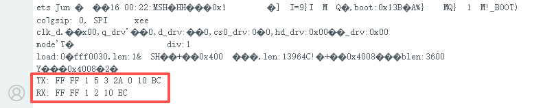
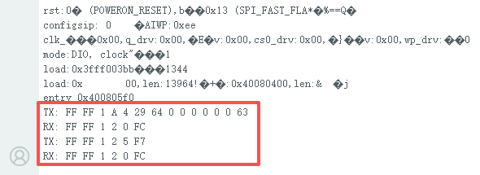
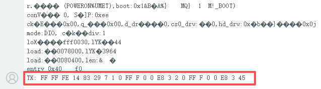
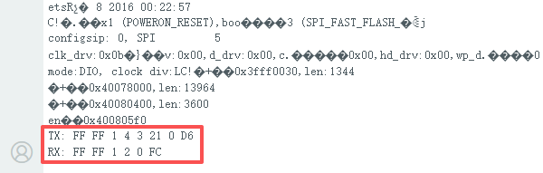

# 2. ESP32 Development

## 2.1 Getting Started

### 2.1.1 Wiring Instruction

This example uses an ESP32 microcontroller with an ESP32 expansion board for development and is powered through a data cable. The bus servo is connected to the debugging board which is powered by an 11.1 V lithium battery. The ESP32 microcontroller and the debugging board are then connected via serial pins using Dupont wires.



> [!NOTE]
>
> * **When using Hiwonder's lithium battery connect the battery adapter cable with the red wire to the positive (+) terminal and the black wire to the negative (-) terminal at the DC interface.**
>* **If the provided connection cable is not attached to the lithium battery, do not directly connect it to the battery interface in order to prevent a short circuit caused by contact between the positive and negative terminals.**

### 2.1.2 Environment Configuration

Install the Arduino IDE on PC. The installation files reside under [**2. Softwares -> Arduino Environment Setup**](https://drive.google.com/drive/folders/1Z5_FFnNogm2xk2ntDhvZFhZyxWrilb9E). Consult the associated documentation in that directory for detailed Arduino IDE usage.

## 2.2 Development Example

> [!NOTE]
>
> **Before running this example, ensure the jumper cap on the debugging board is correctly placed on the upper row's Servo and TTL pins to establish proper communication.**
>
> 

### 2.2.1 Reading the Servo Status

This example demonstrates how to display the status of the bus servo through the debugger window.

**2.2.1.1 Run Program**

Double-click **Serial_Servo.ino** located at the [**01 ESP32 Development\ Program\ Serial_Servo**](https://drive.google.com/drive/folders/1dwBYlEN0qjch78LfS1gWCoQSE9BQTGm3) folder.

After connecting the ESP32 microcontroller to the computer, choose as the development board type. Click to download the program.



**2.2.1.2 Program Outcome**

Once the program is running, the serial debugger displays both the transmitted data packets and the servo status, which corresponds to the data frames returned by the servo.



**2.2.1.3 Program Brief Analysis**

* Import the servo communication library, then define two hardware serial communication ports. Create a SerialServo instance configured to use the Serial port, with the ESP32 communicating with the PC software at a baud rate of 115200 and with the debugging board at 1000000, utilizing TX pin 1 and RX pin 0.

```
#include "HX_30HM.h"

#define RXD1 16
#define TXD1 17

SerialServo servo(Serial1, 1000000, TXD1, RXD1);
```

> [!NOTE]
>
> **Adjust the specified serial port, such as Serial, Serial1, or Serial2, along with the assigned TX and RX pin numbers according to the actual hardware connections.**

* Define the parameters to send and receive.

```
ServoStatus_t status;

int16_t write_pos = 4096;
int16_t read_pos = 4096;

int16_t write_pos_offset = 100;
int16_t read_pos_offset;

uint8_t write_acc = 100;

int16_t write_speed = 1000;
int16_t read_speed;

int16_t write_pwm_speed = 1000;

uint16_t write_torque = 1000;

int16_t sync_write1[2][4] = {{1, 0, 1000, 4095},
						   {2, 0, 1000, 4095}};

int16_t sync_write2[2][4] = {{1, 0, 1000, 0},
						   {2, 0, 1000, 0}};
uint8_t read_id[] = {1, 2};
int16_t sync_read_data[2][5];

uint8_t temp;
uint8_t vol;
uint16_t cur;
int16_t read_load;
uint8_t moving_status;
```

* Initialize the primary serial port on the ESP32 for debug output, which displays both the transmitted data packets and the data frames returned by the servos. The `ping` function broadcasts a search for connected servos, prints their detected ID numbers, and finally returns the operational status of each servo.

```
void setup() {
  Serial.begin(115200);

  status = servo.ping(0xFE);
  Serial.printf("ID:%d\n", status.id); 
  Serial.printf("状态：%X\n", status.error_byte);  
}
```

### 2.2.2 Reading the Servo Position

This example demonstrates how to display the status of the bus servo through the debugger window.

**2.2.2.1 Run Program**

Double-click **Serial_Servo.ino** located at the [**01 ESP32 Development\ Program\ Serial_Servo**](https://drive.google.com/drive/folders/1dwBYlEN0qjch78LfS1gWCoQSE9BQTGm3) folder.

After connecting the ESP32 microcontroller to the computer, choose as the development board type. Click to download the program.

**2.2.2.2 Program Outcome**

Once the program is running, the serial debugger displays the transmitted data packets alongside the current position of the servo, which is contained in the data frames returned by the servo.



**2.2.2.3 Program Brief Analysis**

* Import the servo communication library, then define two hardware serial communication ports. Create a SerialServo instance configured to use the Serial port, with the ESP32 communicating with the PC software at a baud rate of 115200 and with the debugging board at 1000000, utilizing TX pin 1 and RX pin 0.

```
#include "HX_30HM.h"

#define RXD1 16
#define TXD1 17

SerialServo servo(Serial1, 1000000, TXD1, RXD1);
```

> [!NOTE]
>
> **Adjust the specified serial port, such as Serial, Serial1, or Serial2, along with the assigned TX and RX pin numbers according to the actual hardware connections.**

* Define the parameters to send and receive.

```
ServoStatus_t status;

int16_t write_pos = 4096;
int16_t read_pos = 4096;

int16_t write_pos_offset = 100;
int16_t read_pos_offset;

uint8_t write_acc = 100;

int16_t write_speed = 1000;
int16_t read_speed;

int16_t write_pwm_speed = 1000;

uint16_t write_torque = 1000;

int16_t sync_write1[2][4] = {{1, 0, 1000, 4095},
						   {2, 0, 1000, 4095}};

int16_t sync_write2[2][4] = {{1, 0, 1000, 0},
						   {2, 0, 1000, 0}};
uint8_t read_id[] = {1, 2};
int16_t sync_read_data[2][5];

uint8_t temp;
uint8_t vol;
uint16_t cur;
int16_t read_load;
uint8_t moving_status;
```

* Initialize the primary serial port on the ESP32 for debug output. The serial debugger then prints the transmitted data packets and the data frames returned by the servo. The `read_pos` function reads the current position value of servo ID 1 and displays this value in the serial debugger.

```
void setup() {
  Serial.begin(115200);

  status = servo.read_pos(1, &read_pos); 
  Serial.println(read_pos);
}
```

### 2.2.3 Servo Movement Control in Write Mode

**2.2.3.1 Run Program**

Double-click **Serial_Servo.ino** located at the [**01 ESP32 Development\ Program\ Serial_Servo**](https://drive.google.com/drive/folders/1dwBYlEN0qjch78LfS1gWCoQSE9BQTGm3) folder.

After connecting the ESP32 microcontroller to the computer, choose as the development board type. Click to download the program.

**2.2.3.2 Program Outcome**

Once the program is running, the serial debugger displays both the transmitted data packets and the data frames returned by the servo. Simultaneously, the servo with the specified ID will rotate to its target position based on the preset parameters.



**2.2.3.3 Program Brief Analysis**

* Import the servo communication library, then define two hardware serial communication ports. Create a SerialServo instance configured to use the Serial port, with the ESP32 communicating with the PC software at a baud rate of 115200 and with the debugging board at 1000000, utilizing TX pin 1 and RX pin 0.

```
#include "HX_30HM.h"

#define RXD1 16
#define TXD1 17

SerialServo servo(Serial1, 1000000, TXD1, RXD1);
```

> [!NOTE]
>
> **Adjust the specified serial port, such as Serial, Serial1, or Serial2, along with the assigned TX and RX pin numbers according to the actual hardware connections.**

* Define the parameters to send and receive.

```
ServoStatus_t status;

int16_t write_pos = 4096;
int16_t read_pos = 4096;

int16_t write_pos_offset = 100;
int16_t read_pos_offset;

uint8_t write_acc = 100;

int16_t write_speed = 1000;
int16_t read_speed;

int16_t write_pwm_speed = 1000;

uint16_t write_torque = 1000;

int16_t sync_write1[2][4] = {{1, 0, 1000, 4095},
						   {2, 0, 1000, 4095}};

int16_t sync_write2[2][4] = {{1, 0, 1000, 0},
						   {2, 0, 1000, 0}};
uint8_t read_id[] = {1, 2};
int16_t sync_read_data[2][5];

uint8_t temp;
uint8_t vol;
uint16_t cur;
int16_t read_load;
uint8_t moving_status;
```

* Initialize the primary serial port on the ESP32 for debug output. The serial debugger then prints the transmitted data packets and the data frames returned by the servo. The `write_pos` function sets the target position for servo ID 1, causing the servo to rotate to that specified location.

```
void setup() {
  Serial.begin(115200);

  status = servo.write_pos(1, write_pos); 
}
```

### 2.2.4 Servo Movement Control in RegWrite Mode

**2.2.4.1 Run Program**

Double-click **Serial_Servo.ino** located at the [**01 ESP32 Development\ Program\ Serial_Servo**](https://drive.google.com/drive/folders/1dwBYlEN0qjch78LfS1gWCoQSE9BQTGm3) folder.

After connecting the ESP32 microcontroller to the computer, choose as the development board type. Click to download the program.

**2.2.4.2 Program Outcome**

Once the program is running, the serial debugger displays both the transmitted data packets and the data frames returned by the servo. Simultaneously, the servo with the specified ID will rotate to its target position based on the preset parameters.



**2.2.4.3 Program Brief Analysis**

* Import the servo communication library, then define two hardware serial communication ports. Create a SerialServo instance configured to use the Serial port, with the ESP32 communicating with the PC software at a baud rate of 115200 and with the debugging board at 1000000, utilizing TX pin 1 and RX pin 0.

```
#include "HX_30HM.h"

#define RXD1 16
#define TXD1 17

SerialServo servo(Serial1, 1000000, TXD1, RXD1);
```

> [!NOTE]
>
> **Adjust the specified serial port, such as Serial, Serial1, or Serial2, along with the assigned TX and RX pin numbers according to the actual hardware connections.**

* Define the parameters to send and receive.

```
ServoStatus_t status;

int16_t write_pos = 4096;
int16_t read_pos = 4096;

int16_t write_pos_offset = 100;
int16_t read_pos_offset;

uint8_t write_acc = 100;

int16_t write_speed = 1000;
int16_t read_speed;

int16_t write_pwm_speed = 1000;

uint16_t write_torque = 1000;

int16_t sync_write1[2][4] = {{1, 0, 1000, 4095},
						   {2, 0, 1000, 4095}};

int16_t sync_write2[2][4] = {{1, 0, 1000, 0},
						   {2, 0, 1000, 0}};
uint8_t read_id[] = {1, 2};
int16_t sync_read_data[2][5];

uint8_t temp;
uint8_t vol;
uint16_t cur;
int16_t read_load;
uint8_t moving_status;
```

* Initialize the primary serial port on the ESP32 for debug output. The serial debugger displays both the transmitted data packets and the data frames returned by the servo. The `write_reg_pos_ex` function writes acceleration, speed, and position to a specified register address of servo ID 1, which is queued without immediate execution. The `reg_action` function then triggers this queued command, instructing the servo to perform the motion.

```
void setup() {
  Serial.begin(115200);

  status = servo.write_reg_pos_ex(1, write_acc, write_speed, 0);
  status = servo.reg_action(1);
}
```

### 2.2.5 Servo Movement Control in SyncWrite Mode

**2.2.5.1 Run Program**

Double-click **Serial_Servo.ino** located at the [**01 ESP32 Development\ Program\ Serial_Servo**](https://drive.google.com/drive/folders/1dwBYlEN0qjch78LfS1gWCoQSE9BQTGm3) folder.

After connecting the ESP32 microcontroller to the computer, choose as the development board type. Click to download the program.

**2.2.5.2 Program Outcome**

Once the program is running, the serial debugger displays the transmitted data packets. Simultaneously, the servo with the specified ID will rotate to its target position based on the preset parameters.



**2.2.5.3 Program Brief Analysis**

* Import the servo communication library, then define two hardware serial communication ports. Create a SerialServo instance configured to use the Serial port, with the ESP32 communicating with the PC software at a baud rate of 115200 and with the debugging board at 1000000, utilizing TX pin 1 and RX pin 0.

```
#include "HX_30HM.h"

#define RXD1 16
#define TXD1 17

SerialServo servo(Serial1, 1000000, TXD1, RXD1);
```

> [!NOTE]
>
> **Adjust the specified serial port, such as Serial, Serial1, or Serial2, along with the assigned TX and RX pin numbers according to the actual hardware connections.**

* Define the parameters to send and receive.

```
ServoStatus_t status;

int16_t write_pos = 4096;
int16_t read_pos = 4096;

int16_t write_pos_offset = 100;
int16_t read_pos_offset;

uint8_t write_acc = 100;

int16_t write_speed = 1000;
int16_t read_speed;

int16_t write_pwm_speed = 1000;

uint16_t write_torque = 1000;

int16_t sync_write1[2][4] = {{1, 0, 1000, 4095},
						   {2, 0, 1000, 4095}};

int16_t sync_write2[2][4] = {{1, 0, 1000, 0},
						   {2, 0, 1000, 0}};
uint8_t read_id[] = {1, 2};
int16_t sync_read_data[2][5];

uint8_t temp;
uint8_t vol;
uint16_t cur;
int16_t read_load;
uint8_t moving_status;
```

* Initialize the primary serial port on the ESP32 for debug output. The serial debugger then prints the transmitted data packets. The `sync_write_pos_ex` function sets the speed and position for servos with IDs 1 and 2, causing both servos to rotate to their specified positions simultaneously.

```
void setup() {
  Serial.begin(115200);

  status = servo.sync_write_pos_ex(sync_write1, 2);
}
```

### 2.2.6 Setting the Servo Operating Mode

**2.2.6.1 Run Program**

Double-click **Serial_Servo.ino** located at the [**01 ESP32 Development\ Program\ Serial_Servo**](https://drive.google.com/drive/folders/1dwBYlEN0qjch78LfS1gWCoQSE9BQTGm3) folder.

After connecting the ESP32 microcontroller to the computer, choose as the development board type. Click to download the program.

**2.2.6.2 Program Outcome**

Once the program is running, the serial debugger displays the transmitted data packets and the data frames returned by the servo. Simultaneously, it will configure the operation mode for the servo with the specified ID.



**2.2.6.3 Program Brief Analysis**

* Import the servo communication library, then define two hardware serial communication ports. Create a SerialServo instance configured to use the Serial port, with the ESP32 communicating with the PC software at a baud rate of 115200 and with the debugging board at 1000000, utilizing TX pin 1 and RX pin 0.

```
#include "HX_30HM.h"

#define RXD1 16
#define TXD1 17

SerialServo servo(Serial1, 1000000, TXD1, RXD1);
```

> [!NOTE]
>
> **Adjust the specified serial port, such as Serial, Serial1, or Serial2, along with the assigned TX and RX pin numbers according to the actual hardware connections.**

* Define the parameters to send and receive.

```
ServoStatus_t status;

int16_t write_pos = 4096;
int16_t read_pos = 4096;

int16_t write_pos_offset = 100;
int16_t read_pos_offset;

uint8_t write_acc = 100;

int16_t write_speed = 1000;
int16_t read_speed;

int16_t write_pwm_speed = 1000;

uint16_t write_torque = 1000;

int16_t sync_write1[2][4] = {{1, 0, 1000, 4095},
						   {2, 0, 1000, 4095}};

int16_t sync_write2[2][4] = {{1, 0, 1000, 0},
						   {2, 0, 1000, 0}};
uint8_t read_id[] = {1, 2};
int16_t sync_read_data[2][5];

uint8_t temp;
uint8_t vol;
uint16_t cur;
int16_t read_load;
uint8_t moving_status;
```

* Initialize the primary serial port on the ESP32 for debug output. The serial debugger then prints the transmitted data packets and the data frames returned by the servo. The `select_mode` function sets the operation mode for servo ID 1.

```
void setup() {
  Serial.begin(115200);

  status = servo.select_mode(1, 0); 
}
```
