# 3. STM32 Development

## 3.1 Getting Startd		

### 3.1.1 Wiring Instruction 

This example utilizes Hiwonder's STM32 core board for development. The board is powered, programmed, and receives debug data through a single USB cable. Connect the bus servos to the debugging board, which is powered by an 11.1V lithium battery. Finally, link the STM32F103RBT6 microcontroller to the debugging board by connecting their serial communication pins using DuPont wires.

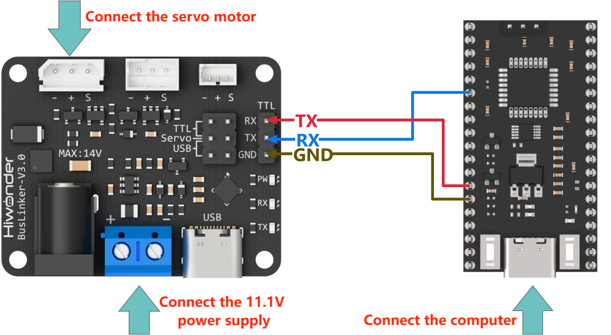

> [!NOTE]
>
> * **When using Hiwonder's lithium battery connect the battery adapter cable with the red wire to the positive (+) terminal and the black wire to the negative (-) terminal at the DC interface.**
> * **If the provided connection cable is not attached to the lithium battery, do not directly connect it to the battery interface in order to prevent a short circuit caused by contact between the positive and negative terminals.**

### 3.1.2 Environment Configuration

Install Keil MDK IDE on PC. The software package is stored in [**2. Softwares->STM32 Programming Software**](https://drive.google.com/drive/folders/18qlBrcZramaVbRC5oqPHpruvrIrgtfeC). For the detailed operations of Keil MDK IDE, please refer to the relevant tutorials.

### 3.1.3 Program Flashing

1. Connect the controller to the computer using a USB cable.

2. Double-click STM32 serial port programming software **FlyMcu** .

3. Click the ① ”**...**” icon and select the HEX file to be programmed from the path: [**Serial_Servo\MDK-ARM\Serial_Servo**]().


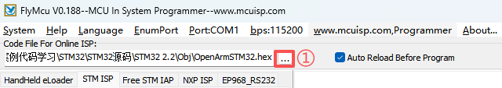

4. At location ② in the following image, select the COM port corresponding to the core board. At ③, set the baud rate to 115200. Configure the options at locations ④ and ⑤ according to the selections shown in the image.

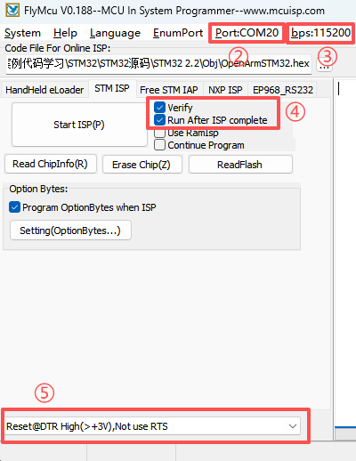

5. Click **Start ISP(P)**, then press the **RST** button on the core board. The program will begin downloading automatically. The download is complete when the right-hand log output panel displays the following content.

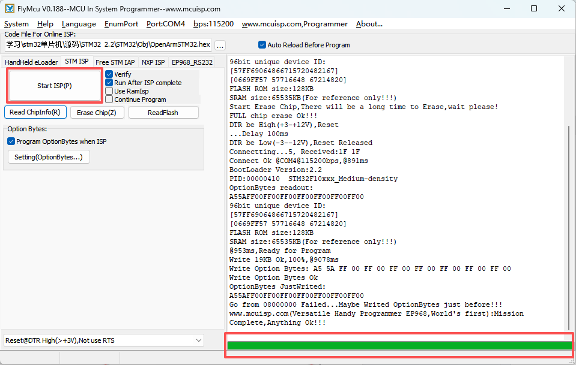

## 3.2 Development Example

> [!NOTE]
>
> **Before running, ensure the jumper cap on the debugging board is connected to the Servo and TTL pins on the upper row to establish proper communication.**

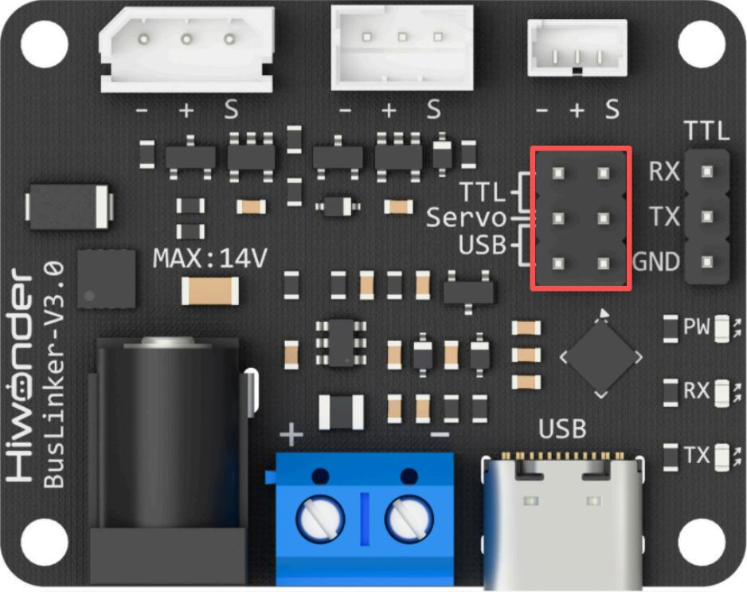

### 3.2.1 Reading the Servo Status

This example demonstrates how to display the status of the bus servo through the serial debug assistant window.

**3.2.1.1 Run Program**

Double-click the **Serial_Servo.uvprojx**  file located at the [**02 STM32 Development\ Program\ Serial_Servo \ MDK-ARM**](https://drive.google.com/drive/folders/10QzeNPG9d2dDj2sUDL4hl-rKvzbmBjmM) folder. Change the value of the **exp** macro definition in the **main.c** file to **1**, then compile the project.

```
/* Private define ------------------------------------------------------------*/
/* USER CODE BEGIN PD */
#define exp 1
```

Connect the STM32F103RBT6 microcontroller to the PC and upload the compiled hex file to the device.

**3.2.1.2 Program Outcome**

After the program runs, open the serial debug assistant. Select the corresponding **COM Port**, set the **Baud Rate** to 115200, and then click the **Open Port**. This procedure is consistent for the following examples. The debug assistant displays the transmitted data packets and the servo status information, which corresponds to the data frames returned by the servo.

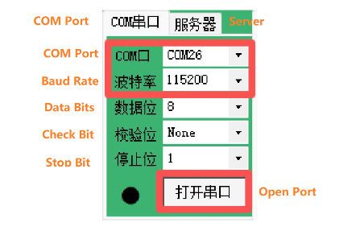

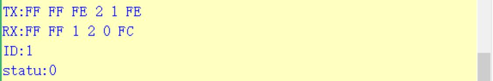

**3.2.1.3 Program Brief Analysis**

* Import the servo communication library along with the communication command parsing library.

```
#include "HX_30HM.h"
#include "stdio.h"
#include "stdint.h"
#include "Packet_Handler.h"
```

* Define the parameters to send and receive.

```
ServoStatus_t status;

int16_t write_pos = 4096;
int16_t read_pos = 4096;

int16_t write_pos_offset = 100;
int16_t read_pos_offset;

uint8_t write_acc = 100;

int16_t write_speed = 1000;
int16_t read_speed;

int16_t write_pwm_speed = 1000;

uint16_t write_torque = 1000;

int16_t sync_write1[2][4] = {{1, 0, 1000, 4095}, {2, 0, 1000, 4095}};
int16_t sync_write2[2][4] = {{1, 0, 1000, 0}, {2, 0, 1000, 0}};
uint8_t read_id[] = {1, 2};
int16_t sync_read_data[2][5];

uint8_t temp;
uint8_t vol;
uint16_t cur;
int16_t read_load;
uint8_t moving_status;
```

* Define two hardware serial ports. Serial port 1 is used to output debug information to the computer's serial debug assistant at a baud rate of 115200. Serial port 2 communicates with the debugging board's serial interface at a baud rate of 1000000.

```
#include "HX_30HM.h"

/* Initialize all configured peripherals */ 
MX_GPIO_Init();
MX_DMA_Init();
MX_USART1_UART_Init();
MX_USART2_UART_Init();

/* Initialize interrupts */ 
MX_NVIC_Init();
/* USER CODE BEGIN 2 */ 
servo_init();
```

* The `ping` function broadcasts a search for connected servos, prints the detected ID numbers, and finally returns the working status of each servo.

```
status = servo_ping(0xFE);
```

* The transmitted data packets and the data frames returned by the servo are output to the PC serial assistant for debugging.

```
sprintf((char *)info_buf,"TX:%X %X %X %X %X %X\r\n",servo_packet.tx.header_1,\ servo_packet.tx.header_2,\
servo_packet.tx.elements.id,\
servo_packet.tx.elements.length,\
servo_packet.tx.elements.cmd,\

servo_packet.tx.elements.args[servo_packet.tx.elements.length - 2]\
);
serial_printf_string(info_buf);

sprintf((char *)info_buf,"RX:%X %X %X %X %X %X\r\n",servo_packet.rx.header_1,\
servo_packet.rx.header_2,\
servo_packet.rx.elements.id,\
servo_packet.rx.elements.length,\
servo_packet.rx.elements.cmd,\

servo_packet.rx.elements.args[servo_packet.rx.elements.length - 2]\
);
serial_printf_string(info_buf);
```

* The returned servo ID and working status parameters are displayed in the PC serial assistant for debugging.

```
sprintf((char *)info_buf,"ID:%X\r\n",status.id);
serial_printf_string(info_buf);

sprintf((char *)info_buf,"statu:%X\r\n",status.error_byte); 
serial_printf_string(info_buf);
```

### 3.2.2 Reading the Servo Status

This example demonstrates how to display the current position of the bus servo through the serial debug assistant window.

**3.2.2.1 Run Program**

Double-click the **Serial_Servo.uvprojx**  file located at the [**02 STM32 Development\ Program\ Serial_Servo \ MDK-ARM**](https://drive.google.com/drive/folders/10QzeNPG9d2dDj2sUDL4hl-rKvzbmBjmM) folder. Change the value of the **exp** macro definition in the **main.c** file to **1**, then compile the project.

```
/* Private define ------------------------------------------------------------*/
/* USER CODE BEGIN PD */
#define exp 1
```

Connect the STM32F103RBT6 microcontroller to the PC and upload the compiled hex file to the device.

**3.3.2.2 Program Outcome**

After the program starts running, the serial debugging window displays the transmitted data packets and the current servo position, which correspond to the data frames returned by the servo.


**3.3.2.3 Program Brief Analysis**

* Import the servo communication library along with the communication command parsing library.

```
#include "HX_30HM.h"
#include "stdio.h"
#include "stdint.h"
#include "Packet_Handler.h"
```

* Define the parameters to send and receive.

```
ServoStatus_t status;

int16_t write_pos = 4096;
int16_t read_pos = 4096;

int16_t write_pos_offset = 100;
int16_t read_pos_offset;

uint8_t write_acc = 100;

int16_t write_speed = 1000;
int16_t read_speed;

int16_t write_pwm_speed = 1000;

uint16_t write_torque = 1000;

int16_t sync_write1[2][4] = {{1, 0, 1000, 4095}, {2, 0, 1000, 4095}};
int16_t sync_write2[2][4] = {{1, 0, 1000, 0}, {2, 0, 1000, 0}};
uint8_t read_id[] = {1, 2};
int16_t sync_read_data[2][5];

uint8_t temp;
uint8_t vol;
uint16_t cur;
int16_t read_load;
uint8_t moving_status;
```

* Two hardware serial interfaces are defined. Serial port 1 is used to output debug information to the PC serial assistant at a baud rate of 115200. Serial port 2 is used for serial communication with the debugging board at a baud rate of 1000000.

```
#include "HX_30HM.h"

/* Initialize all configured peripherals */ 
MX_GPIO_Init();
MX_DMA_Init();
MX_USART1_UART_Init();
MX_USART2_UART_Init();

/* Initialize interrupts */ 
MX_NVIC_Init();
/* USER CODE BEGIN 2 */ 
servo_init();
```

* The `read_pos` function reads the current position value of servo ID 1.

```
status = servo_read_pos(1, &read_pos);
```

* The transmitted data packets and the data frames returned by the servo are printed to the PC serial assistant.

```
sprintf((char *)info_buf,"TX:%X %X %X %X %X %X\r\n",servo_packet.tx.header_1,\ servo_packet.tx.header_2,\
servo_packet.tx.elements.id,\
servo_packet.tx.elements.length,\
servo_packet.tx.elements.cmd,\

servo_packet.tx.elements.args[servo_packet.tx.elements.length - 2]\
);
serial_printf_string(info_buf);

sprintf((char *)info_buf,"RX:%X %X %X %X %X %X\r\n",servo_packet.rx.header_1,\
servo_packet.rx.header_2,\
servo_packet.rx.elements.id,\
servo_packet.rx.elements.length,\
servo_packet.rx.elements.cmd,\

servo_packet.rx.elements.args[servo_packet.rx.elements.length - 2]\
);
serial_printf_string(info_buf);
```

*  The returned current position value of the servo is printed to the PC serial assistant.

```
sprintf((char *)info_buf,"Position:%hu\r\n",read_pos); 
serial_printf_string(info_buf);
```

### 3.2.3 Servo Movement Control in Write Mode

**3.2.3.1 Run Program**

Double-click the **Serial_Servo.uvprojx**  file located at the [**02 STM32 Development\ Program\ Serial_Servo \ MDK-ARM**](https://drive.google.com/drive/folders/10QzeNPG9d2dDj2sUDL4hl-rKvzbmBjmM) folder. Change the value of the **exp** macro definition in the **main.c** file to **1**, then compile the project.

```
/* Private define ------------------------------------------------------------*/
/* USER CODE BEGIN PD */
#define exp 1
```

Connect the STM32F103RBT6 microcontroller to the PC and upload the compiled hex file to the device.

**3.2.3.2 Program Outcome**

After the program starts running, the serial monitor displays the transmitted data packets and the data frames returned by the servo, and the servo with the specified ID moves to the target position according to the configured parameters.

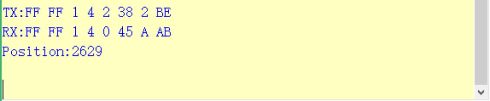

**3.2.3.3 Program Brief Analysis**

* Import the servo communication library along with the communication command parsing library.

```
#include "HX_30HM.h"
#include "stdio.h"
#include "stdint.h"
#include "Packet_Handler.h"
```

* Define the parameters to send and receive.

```
ServoStatus_t status;

int16_t write_pos = 4096;
int16_t read_pos = 4096;

int16_t write_pos_offset = 100;
int16_t read_pos_offset;

uint8_t write_acc = 100;

int16_t write_speed = 1000;
int16_t read_speed;

int16_t write_pwm_speed = 1000;

uint16_t write_torque = 1000;

int16_t sync_write1[2][4] = {{1, 0, 1000, 4095}, {2, 0, 1000, 4095}};
int16_t sync_write2[2][4] = {{1, 0, 1000, 0}, {2, 0, 1000, 0}};
uint8_t read_id[] = {1, 2};
int16_t sync_read_data[2][5];

uint8_t temp;
uint8_t vol;
uint16_t cur;
int16_t read_load;
uint8_t moving_status;
```

* Two hardware serial interfaces are defined. Serial port 1 is used to output debug information to the PC serial assistant at a baud rate of 115200. Serial port 2 is used for serial communication with the debugging board at a baud rate of 1000000.

```
#include "HX_30HM.h"

/* Initialize all configured peripherals */ 
MX_GPIO_Init();
MX_DMA_Init();
MX_USART1_UART_Init();
MX_USART2_UART_Init();

/* Initialize interrupts */ 
MX_NVIC_Init();
/* USER CODE BEGIN 2 */ 
servo_init();
```

* The `write_pos` function sets the target position of servo ID 1 and drives the servo to move to that position.

```
status = servo_write_pos(1, write_pos);
```

* The transmitted data packets and the data frames returned by the servo are printed to the PC serial assistant.

```
sprintf((char *)info_buf,"TX:%X %X %X %X %X %X\r\n",servo_packet.tx.header_1,\ servo_packet.tx.header_2,\
servo_packet.tx.elements.id,\
servo_packet.tx.elements.length,\
servo_packet.tx.elements.cmd,\

servo_packet.tx.elements.args[servo_packet.tx.elements.length - 2]\
);
serial_printf_string(info_buf);

sprintf((char *)info_buf,"RX:%X %X %X %X %X %X\r\n",servo_packet.rx.header_1,\
servo_packet.rx.header_2,\
servo_packet.rx.elements.id,\
servo_packet.rx.elements.length,\
servo_packet.rx.elements.cmd,\

servo_packet.rx.elements.args[servo_packet.rx.elements.length - 2]\
);
serial_printf_string(info_buf);
```

*  The configured target position value of the servo is printed to the PC serial assistant.

```
sprintf((char *)info_buf,"Position:%hu\r\n",read_pos); 
serial_printf_string(info_buf);
```

### 3.2.4 Reading the Servo Status

**3.2.4.1 Run Program**

Double-click the **Serial_Servo.uvprojx**  file located at the [**02 STM32 Development\ Program\ Serial_Servo \ MDK-ARM**](https://drive.google.com/drive/folders/10QzeNPG9d2dDj2sUDL4hl-rKvzbmBjmM) folder. Change the value of the **exp** macro definition in the **main.c** file to **1**, then compile the project.

```
/* Private define ------------------------------------------------------------*/
/* USER CODE BEGIN PD */
#define exp 1
```

Connect the STM32F103RBT6 microcontroller to the PC and upload the compiled hex file to the device.

**3.2.4.2 Program Outcome**

After the program starts running, the serial monitor displays the transmitted data packets and the data frames returned by the servo, and the servo with the specified ID moves to the target position according to the configured parameters.

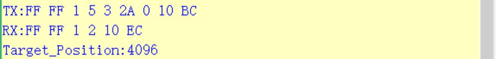

**3.2.4.3 Program Brief Analysis**

* Import the servo communication library along with the communication command parsing library.

```
#include "HX_30HM.h"
#include "stdio.h"
#include "stdint.h"
#include "Packet_Handler.h"
```

* Define the parameters to send and receive.

```
ServoStatus_t status;

int16_t write_pos = 4096;
int16_t read_pos = 4096;

int16_t write_pos_offset = 100;
int16_t read_pos_offset;

uint8_t write_acc = 100;

int16_t write_speed = 1000;
int16_t read_speed;

int16_t write_pwm_speed = 1000;

uint16_t write_torque = 1000;

int16_t sync_write1[2][4] = {{1, 0, 1000, 4095}, {2, 0, 1000, 4095}};
int16_t sync_write2[2][4] = {{1, 0, 1000, 0}, {2, 0, 1000, 0}};
uint8_t read_id[] = {1, 2};
int16_t sync_read_data[2][5];

uint8_t temp;
uint8_t vol;
uint16_t cur;
int16_t read_load;
uint8_t moving_status;
```

*  The `write_reg_pos_ex` function writes acceleration, speed and position to the specified register address of servo ID 1, with execution deferred until triggered by the action command.

```
status = servo_write_reg_pos_ex(1, write_acc, write_speed, write_pos);
```

* The transmitted data packets and the data frames returned by the servo are printed to the PC serial assistant.

```
sprintf((char *)info_buf,"TX:%X %X %X %X %X %X %X %X %X %X %X %X %X %X %X\r\n",servo_packet.tx.header_1,\
servo_packet.tx.header_2,\
servo_packet.tx.elements.id,\
servo_packet.tx.elements.length,\
servo_packet.tx.elements.cmd,\
servo_packet.tx.elements.args[0],\
servo_packet.tx.elements.args[1],\
servo_packet.tx.elements.args[2],\
servo_packet.tx.elements.args[3],\
servo_packet.tx.elements.args[4],\
servo_packet.tx.elements.args[5],\
servo_packet.tx.elements.args[6],\
servo_packet.tx.elements.args[7],\
servo_packet.tx.elements.args[8],\
servo_packet.tx.elements.args[servo_packet.tx.elements.length - 2]\
);
serial_printf_string(info_buf);

sprintf((char *)info_buf,"RX:%X %X %X %X %X %X\r\n",servo_packet.rx.header_1,\
servo_packet.rx.header_2,\
servo_packet.rx.elements.id,\
servo_packet.rx.elements.length,\
servo_packet.rx.elements.cmd,\
servo_packet.rx.elements.args[servo_packet.rx.elements.length - 2]\
);
serial_printf_string(info_buf);
```

* Call the `reg_action` function to trigger and execute the motion defined by the `write_reg_pos_ex` function, thereby initiating servo movement.

```
status = servo_reg_action(1);
```

* The transmitted data packets and the data frames returned by the servo are printed to the PC serial assistant.

```
sprintf((char *)info_buf,"TX:%X %X %X %X %X %X\r\n",servo_packet.tx.header_1,\
servo_packet.tx.header_2,\
servo_packet.tx.elements.id,\
servo_packet.tx.elements.length,\
servo_packet.tx.elements.cmd,\
servo_packet.tx.elements.args[servo_packet.tx.elements.length - 2]\
);
serial_printf_string(info_buf);

sprintf((char *)info_buf,"RX:%X %X %X %X %X %X\r\n",servo_packet.rx.header_1,\
servo_packet.rx.header_2,\
servo_packet.rx.elements.id,\
servo_packet.rx.elements.length,\
servo_packet.rx.elements.cmd,\
servo_packet.rx.elements.args[servo_packet.rx.elements.length - 2]\
);
serial_printf_string(info_buf);
```

* The configured acceleration, speed and position parameters are printed to the PC serial monitor.

```
sprintf((char *)info_buf,"Target_Acc:%hu,Target_Speed:%hu,Target_Pos:%hu\r\n",write_acc, write_speed, write_pos);
serial_printf_string(info_buf);
```

### 3.2.5 Servo Movement Control in SyncWrite Mode

**3.2.5.1 Run Program**

Double-click the **Serial_Servo.uvprojx**  file located at the [**02 STM32 Development\ Program\ Serial_Servo \ MDK-ARM**](https://drive.google.com/drive/folders/10QzeNPG9d2dDj2sUDL4hl-rKvzbmBjmM) folder. Change the value of the **exp** macro definition in the **main.c** file to **1**, then compile the project.

```
/* Private define ------------------------------------------------------------*/
/* USER CODE BEGIN PD */
#define exp 1
```

Connect the STM32F103RBT6 microcontroller to the PC and upload the compiled hex file to the device.

**3.2.5.2 Program Outcome**

After the program starts running, the serial monitor displays the transmitted data packets, and the servo with the specified ID moves to the target position according to the configured parameters.

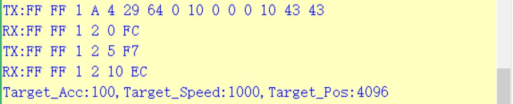

**3.2.5.3 Program Brief Analysis**

* Import the servo communication library along with the communication command parsing library.

```
#include "HX_30HM.h"
#include "stdio.h"
#include "stdint.h"
#include "Packet_Handler.h"
```

* Define the parameters to send and receive.

```
ServoStatus_t status;

int16_t write_pos = 4096;
int16_t read_pos = 4096;

int16_t write_pos_offset = 100;
int16_t read_pos_offset;

uint8_t write_acc = 100;

int16_t write_speed = 1000;
int16_t read_speed;

int16_t write_pwm_speed = 1000;

uint16_t write_torque = 1000;

int16_t sync_write1[2][4] = {{1, 0, 1000, 4095}, {2, 0, 1000, 4095}};
int16_t sync_write2[2][4] = {{1, 0, 1000, 0}, {2, 0, 1000, 0}};
uint8_t read_id[] = {1, 2};
int16_t sync_read_data[2][5];

uint8_t temp;
uint8_t vol;
uint16_t cur;
int16_t read_load;
uint8_t moving_status;
```

* Two hardware serial ports are defined, with Serial Port 1 used to output debug information to the PC serial monitor at a baud rate of 115200, and Serial Port 2 used for serial communication with the debugging board at a baud rate of 1000000.

```
#include "HX_30HM.h"

/* Initialize all configured peripherals */ 
MX_GPIO_Init();
MX_DMA_Init();
MX_USART1_UART_Init();
MX_USART2_UART_Init();

/* Initialize interrupts */ 
MX_NVIC_Init();
/* USER CODE BEGIN 2 */ 
servo_init();
```

* The `sync_write_pos_ex` function sets the acceleration, speed and position parameters for servo IDs 1 and 2, and the servos move to the specified positions simultaneously.

```
// 向1号和2号舵机同时写入加速度、速度和位置信息 (Write acceleration, speed, and position information to servo 1 and 2 simultaneously)
status = servo_sync_write_pos_ex(sync_write1, 2);
```

* The transmitted data packets are printed to the PC serial assistant.

```
sprintf((char *)info_buf,"TX:%X %X %X %X %X %X %X %X %X %X %X %X %X %X %X %X %X %X %X %X %X\r\n",servo_packet.tx.header_1,\
servo_packet.tx.header_2,\
servo_packet.tx.elements.id,\
servo_packet.tx.elements.length,\
servo_packet.tx.elements.cmd,\
servo_packet.tx.elements.args[0],\
servo_packet.tx.elements.args[1],\

servo_packet.tx.elements.args[2],\
servo_packet.tx.elements.args[3],\
servo_packet.tx.elements.args[4],\
servo_packet.tx.elements.args[5],\
servo_packet.tx.elements.args[6],\
servo_packet.tx.elements.args[7],\
servo_packet.tx.elements.args[8],\
servo_packet.tx.elements.args[9],\
servo_packet.tx.elements.args[10],\

servo_packet.tx.elements.args[11],\
servo_packet.tx.elements.args[12],\
servo_packet.tx.elements.args[13],\
servo_packet.tx.elements.args[14],\
servo_packet.tx.elements.args[15],\
servo_packet.tx.elements.args[16],\
servo_packet.tx.elements.args[17],\
servo_packet.tx.elements.args[18],\
servo_packet.tx.elements.args[19],\
servo_packet.tx.elements.args[servo_packet.tx.elements.length - 2]\

);
serial_printf_string(info_buf);
```

* The configured servo ID acceleration, speed and position parameters are printed to the PC serial assistant.

```
sprintf((char*)info_buf,"ServoID:%hu,Target_Acc:%hu,Target_Speed:%hu,Target_Pos:%hu\r\n",\
sync_write1[0][0],sync_write1[0][1],\
sync_write1[0][2],sync_write1[0][3]);
serial_printf_string(info_buf);

sprintf((char
*)info_buf,"ServoID:%hu,Target_Acc:%hu,Target_Speed:%hu,Target_Pos:%hu\r\n",\
sync_write1[1][0],sync_write1[1][1],\
sync_write1[1][2],sync_write1[1][3]);
serial_printf_string(info_buf);
```

### 3.2.6 Reading the Servo Status

**3.2.6.1 Run Program**

Double-click the **Serial_Servo.uvprojx**  file located at the [**02 STM32 Development\ Program\ Serial_Servo \ MDK-ARM**](https://drive.google.com/drive/folders/10QzeNPG9d2dDj2sUDL4hl-rKvzbmBjmM) folder. Change the value of the **exp** macro definition in the **main.c** file to **1**, then compile the project.

```
/* Private define ------------------------------------------------------------*/
/* USER CODE BEGIN PD */
#define exp 1
```

Connect the STM32F103RBT6 microcontroller to the PC and upload the compiled hex file to the device.

**3.2.6.2 Program Outcome**

After the program runs, the serial monitor window displays the transmitted data packets and the data frames returned by the servo. Simultaneously, it will configure the operation mode for the servo with the specified ID.

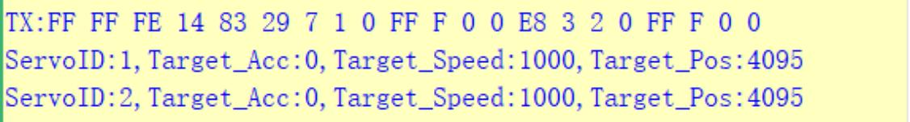

**3.2.6.3 Program Brief Analysis**

* Import the servo communication library along with the communication command parsing library.

```
#include "HX_30HM.h"
#include "stdio.h"
#include "stdint.h"
#include "Packet_Handler.h"
```

* Define the parameters to send and receive.

```
ServoStatus_t status;

int16_t write_pos = 4096;
int16_t read_pos = 4096;

int16_t write_pos_offset = 100;
int16_t read_pos_offset;

uint8_t write_acc = 100;

int16_t write_speed = 1000;
int16_t read_speed;

int16_t write_pwm_speed = 1000;

uint16_t write_torque = 1000;

int16_t sync_write1[2][4] = {{1, 0, 1000, 4095}, {2, 0, 1000, 4095}};
int16_t sync_write2[2][4] = {{1, 0, 1000, 0}, {2, 0, 1000, 0}};
uint8_t read_id[] = {1, 2};
int16_t sync_read_data[2][5];

uint8_t temp;
uint8_t vol;
uint16_t cur;
int16_t read_load;
uint8_t moving_status;
```

* Two hardware serial ports are defined, with Serial Port 1 used to output debug information to the PC serial assistant at a baud rate of 115200, and Serial Port 2 used for serial communication with the debugging board at a baud rate of 1000000.

```
#include "HX_30HM.h"

/* Initialize all configured peripherals */ 
MX_GPIO_Init();
MX_DMA_Init();
MX_USART1_UART_Init();
MX_USART2_UART_Init();

/* Initialize interrupts */ 
MX_NVIC_Init();
/* USER CODE BEGIN 2 */ 
servo_init();
```

* The `select_mode` function sets the operating mode for servo ID 1.

```
status = servo_select_mode(1, 0);
```

* The transmitted data packets and the data frames returned by the servo are printed to the PC serial assistant.

```
sprintf((char *)info_buf,"TX:%X %X %X %X %X %X %X %X\r\n",servo_packet.tx.header_1,\
servo_packet.tx.header_2,\
servo_packet.tx.elements.id,\

servo_packet.tx.elements.length,\
servo_packet.tx.elements.cmd,\

servo_packet.tx.elements.args[0],\

servo_packet.tx.elements.args[1],\
servo_packet.tx.elements.args[servo_packet.tx.elements.length - 2]\
);
serial_printf_string(info_buf);

sprintf((char *)info_buf,"RX:%X %X %X %X %X %X\r\n",servo_packet.rx.header_1,\
servo_packet.rx.header_2,\
servo_packet.rx.elements.id,\
servo_packet.rx.elements.length,\
servo_packet.rx.elements.cmd,\
servo_packet.rx.elements.args[servo_packet.rx.elements.length - 2]\

);
serial_printf_string(info_buf);
```

* The returned servo ID and working status parameters are displayed in the PC serial assistant for debugging.

```
sprintf((char *)info_buf,"Position:%hu\r\n",read_pos); 
serial_printf_string(info_buf);
```