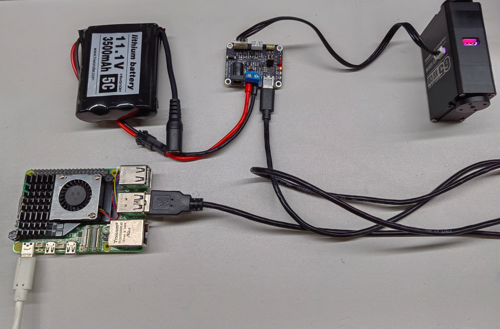

# 4. Raspberry Pi Development

## 4.1 Getting Started

### 4.1.1 Wiring Instruction

This example uses a Raspberry Pi 5 board powered by a 5 V adapter. The bus servo is connected to a debugging board powered by an 11.1 V lithium battery, and the debugging board is connected to any USB port on the Raspberry Pi 5 using a Type-C data cable.



> [!NOTE]
>
> * **When using Hiwonder's lithium battery connect the battery adapter cable with the red wire to the positive (+) terminal and the black wire to the negative (-) terminal at the DC interface.**
>* **If the provided connection cable is not attached to the lithium battery, do not directly connect it to the battery interface in order to prevent a short circuit caused by contact between the positive and negative terminals.**

### 4.1.2 Environment Configuration

在电脑端安装VNC，软件包位于“2 软件工具->远程桌面连接工具”下。关于VNC的详细使用，可在对应目录下进行学习。 

将程序和库文件SDK，拖动到树莓派系统镜像内，这里以放置在桌面的Demo文件夹为例进行。注意：库文件要同程序放在同一目录下。

Install VNC on PC. The software package is stored in [**2 Softwares->Remote Desktop Connection Tool**](https://drive.google.com/drive/folders/1aKPQfxLK9cAWeM88YNUDLCStPtHpgntE). For the detailed operations of VNC, please refer to the relevant tutorials.

Copy the program and the SDK library files into the Raspberry Pi system image, with the Demo folder on the desktop used as an example location.

> [!NOTE]
>
> **The library files must be placed in the same directory as the program.**

## 4.2 Development Example

> [!NOTE]
>
> **Before running this example, ensure the jumper cap on the debugging board is connected to the lower Servo and USB pins to establish proper communication.**
>
> 

### 4.2.1 Reading the Servo Status

This example displays the internal status of the bus servo through a terminal window.

**4.2.1.1 Run Program**

1. Open the terminal and enter the command to switch to the program's directory:

```
cd Desktop/Demo/examples
```


2. Enter the command to run this example program:

```
python3 ping.py
```


**4.2.1.2 Program Outcome**


After the program starts running, the terminal displays servo status, which corresponds to the data frames returned by the servo.

**4.2.1.3 Program Brief Analysis**

* Import the required libraries.

```
import sys
import os

sys.path.append("..")

from servo_sdk import *
```

* Initialize the communication port and the servo object.

```
PortHandler = PortHandler('/dev/ttyACM0') 
ServoHandler = HxServoHandler(PortHandler)
```

* Create and open a port object, then verify and configure the port baud rate.

```
if PortHandler.openPort():
    print("Succeeded to open the port")
else:
    print("Failed to open the port")
    quit()

if PortHandler.setBaudRate(1000000):
    print("Succeeded to change the baudrate")
else:
    print("Failed to change the baudrate")
    quit()
```

* Read the operating status of servo 1 and print the response packet returned by the servo.

```
rxpacket, result, error = ServoHandler.ping(1)
if result != COMM_SUCCESS:
    print("%s" % ServoHandler.getTxRxResult(result))
else:
    print(f"rx: {' '.join(f'{byte:02X}' for byte in rxpacket)}")
if error != 0:
    print("%s" % ServoHandler.getRxPacketError(error))
```

### 4.2.2 Reading the Servo Position

This example displays the internal position of the bus servo through the terminal window.

**4.2.2.1 Run Program**

1. Open the terminal and enter the command to switch to the program's directory:

```
cd Desktop/Demo/examples
```


2. Enter the command to run this example program:

```
python3 read_position.py 
```


**4.2.2.2 Program Outcome**


After the program starts running, the terminal continuously scrolls and displays the current position of the servo.

**4.2.2.3 Program Brief Analysis**

* Import the required libraries.

```
import sys
import os

sys.path.append("..")

from servo_sdk import *
```

* Initialize the communication port and the servo object.

```
PortHandler = PortHandler('/dev/ttyACM0') 
ServoHandler = HxServoHandler(PortHandler)
```

* Create and open a port object, then verify and configure the port baud rate.

```
if PortHandler.openPort():
    print("Succeeded to open the port")
else:
    print("Failed to open the port")
    quit()

if PortHandler.setBaudRate(1000000):
    print("Succeeded to change the baudrate")
else:
    print("Failed to change the baudrate")
    quit()
```

* Continuously read the current position of servo 1 using the `readLoad` function and output the results before finally closing the port.

```
while True:
    pos, result, error = ServoHandler.readLoad(1)
    if result != COMM_SUCCESS:
        print("%s" % ServoHandler.getTxRxResult(result))
        break

    if error != 0:
        print("%s" % ServoHandler.getRxPacketError(error))
        break

    print(pos)
    time.sleep(0.1)  # Delay for 0.1 seconds

PortHandler.closePort()
```

### 4.2.3 Servo Movement Control in Write Mode

**4.2.3.1 Run Program**

1. Open the terminal and enter the command to switch to the program's directory:

```
cd Desktop/Demo/examples
```


2. Enter the command to run this example program:

```
python3 write_position.py
```


**4.2.3.2 Program Outcome**

After the program starts running, servo 1 moves to the position of −3000 at a speed of 100 steps per second with an acceleration of 0 steps per second squared.

**4.2.3.3 Program Brief Analysis**

* Import the required libraries.

```
import sys
import os

sys.path.append("..")

from servo_sdk import *
```

* Initialize the communication port and the servo object.

```
PortHandler = PortHandler('/dev/ttyACM0') 
ServoHandler = HxServoHandler(PortHandler)
```

* Create and open a port object, then verify and configure the port baud rate.

```
if PortHandler.openPort():
    print("Succeeded to open the port")
else:
    print("Failed to open the port")
    quit()

if PortHandler.setBaudRate(1000000):
    print("Succeeded to change the baudrate")
else:
    print("Failed to change the baudrate")
    quit()
```

* Control the servo rotation using the `writePosEx` function and proceed to close the port.

```
result, error = ServoHandler.writePosEx(1, -3000, 100, 0)

if result != COMM_SUCCESS:
    print("%s" % ServoHandler.getTxRxResult(result))
if error != 0:
    print("%s" % ServoHandler.getRxPacketError(error))


# Close port
PortHandler.closePort()
```

### 4.2.4 Servo Movement Control in RegWrite Mode

**4.2.4.1 Run Program**

1. Open the terminal and enter the command to switch to the program's directory:

```
cd Desktop/Demo/examples
```


2. Enter the command to run this example program:

```
python3 write_position.py
```


**4.2.4.2 Program Outcome**

After the program starts running, servo 1 repeatedly moves between the positions of 20 and 1000 at intervals of approximately 0.75 seconds, with a speed of 1500 steps per second and an acceleration of 0 steps per second squared.

**4.2.4.3 Program Brief Analysis**

* Import the required libraries.

```
import sys
import os

sys.path.append("..")

from servo_sdk import *
```

* Initialize the communication port and the servo object.

```
PortHandler = PortHandler('/dev/ttyACM0') 
ServoHandler = HxServoHandler(PortHandler)
```

* Create and open a port object, then verify and configure the port baud rate.

```
if PortHandler.openPort():
    print("Succeeded to open the port")
else:
    print("Failed to open the port")
    quit()

if PortHandler.setBaudRate(1000000):
    print("Succeeded to change the baudrate")
else:
    print("Failed to change the baudrate")
    quit()
```

* Control the servo rotation with the `writeRegPosEx` function, managed by the `regAction` function, and then close the port.

```
while True:
    result, error = ServoHandler.writeRegPosEx(1, 1000, 1500, 0)
    if result != COMM_SUCCESS:
        print("%s" % ServoHandler.getTxRxResult(result))
        break

    if error != 0:
        print("%s" % ServoHandler.getRxPacketError(error))
        break
    ServoHandler.regAction()
    time.sleep(((1000-20) / 1500) + 0.1)  #//[(P1-P0)/(V)] + 0.1

    # Servo (ID1~10) runs at a maximum speed ofV=1500*0.059=88.5rpm until it reaches position P0=20
    result, error = ServoHandler.writeRegPosEx(1, 20, 1500, 0)
    if result != COMM_SUCCESS:
        print("%s" % ServoHandler.getTxRxResult(result))
        break

    if error != 0:
        print("%s" % ServoHandler.getRxPacketError(error))
        break

    ServoHandler.regAction()
    time.sleep(((1000 - 20) / 1500) + 0.1)
    # time.sleep((1000-20)/(1500) + 0.1)) #//[(P1-P0)/(V)] + 0.1

# Close port
PortHandler.closePort()
```

### 4.2.5 Servo Movement Control in SyncWrite Mode

**4.2.5.1 Run Program**

1. Open the terminal and enter the command to switch to the program's directory:

```
cd Desktop/Demo/examples
```


2. Enter the command to run this example program:

```
python3 sync_write.py
```


**4.2.5.2 Program Outcome**

After the program runs, servos 1 to 3 simultaneously perform a reciprocating motion between positions 20 and 1000 at a speed of 1500 steps per second, with zero acceleration and an interval of approximately 0.75 seconds.

**4.2.5.3 Program Brief Analysis**

* Import the required libraries.

```
import sys
import os

sys.path.append("..")

from servo_sdk import *
```

* Initialize the communication port and the servo object.

```
PortHandler = PortHandler('/dev/ttyACM0') 
ServoHandler = HxServoHandler(PortHandler)
```

* Create and open a port object, then verify and configure the port baud rate.

```
if PortHandler.openPort():
    print("Succeeded to open the port")
else:
    print("Failed to open the port")
    quit()

if PortHandler.setBaudRate(1000000):
    print("Succeeded to change the baudrate")
else:
    print("Failed to change the baudrate")
    quit()
```

* Control the servo rotation using the `syncWritePosEx` function and then close the port.

```
while True:
    for id in range(1, 3):
        add_param_result = ServoHandler.syncWritePosEx(id, 1000, 1500, 0)
        if add_param_result != True:
            print("[ID:%03d] groupSyncWrite addparam failed" % id)

    # Syncwrite goal position
    result = ServoHandler.GroupSyncWrite.txPacket()
    if result != COMM_SUCCESS:
        print("%s" % result.getTxRxResult(result))
        break

    time.sleep(((1000-20) / 1500) + 0.1)  #//[(P1-P0)/(V)] + 0.1

    # Clear syncwrite parameter storage
    ServoHandler.GroupSyncWrite.clearParam()

    for id in range(1, 3):
        add_param_result = ServoHandler.syncWritePosEx(id, 20, 1500, 0)
        if add_param_result != True:
            print("[ID:%03d] groupSyncWrite addparam failed" % id)

    # Syncwrite goal position
    result = ServoHandler.GroupSyncWrite.txPacket()
    if result != COMM_SUCCESS:
        print("%s" % result.getTxRxResult(result))
        break

    time.sleep(((1000 - 20) / 1500) + 0.1)
    # time.sleep((1000-20)/(1500) + 0.1)) #//[(P1-P0)/(V)] + 0.1

    # Clear syncwrite parameter storage
    ServoHandler.GroupSyncWrite.clearParam()
# Close port
PortHandler.closePort()
```

### 4.2.6 Setting the Servo Operating Mode

**4.2.6.1 Run Program**

1. Open the terminal and enter the command to switch to the program's directory:

```
cd Desktop/Demo/examples
```


2. Enter the command to run this example program:

```
python3 select_mode.py
```


**4.2.6.2 Program Outcome**

After the program runs, servo 1 will be configured in position servo mode.

**4.2.6.3 Program Brief Analysis**

* Import the required libraries.

```
import sys
import os

sys.path.append("..")

from servo_sdk import *
```

* Initialize the communication port and the servo object.

```
PortHandler = PortHandler('/dev/ttyACM0') 
ServoHandler = HxServoHandler(PortHandler)
```

* Create and open a port object, then verify and configure the port baud rate.

```
if PortHandler.openPort():
    print("Succeeded to open the port")
else:
    print("Failed to open the port")
    quit()

if PortHandler.setBaudRate(1000000):
    print("Succeeded to change the baudrate")
else:
    print("Failed to change the baudrate")
    quit()
```

* Set the servo operation mode using the `selectMode` function.

```
rxpacket, result, error = ServoHandler.selectMode(1, 0)

if result != COMM_SUCCESS:
    print("%s" % ServoHandler.getTxRxResult(result))
else:
    print(f"rx: {' '.join(f'{byte:02X}' for byte in rxpacket)}")
if error != 0:
    print("%s" % ServoHandler.getRxPacketError(error))
```
